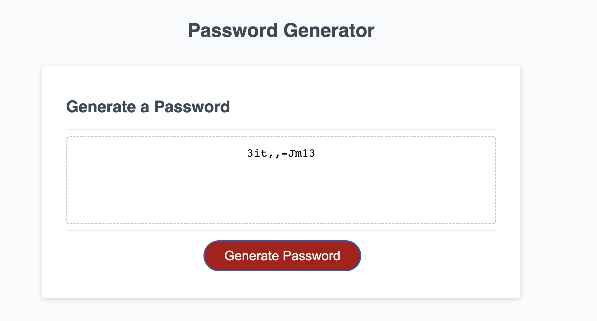

# passwordGenerator
This is a password generator using java mainly.

    This will be located on my repository: https://github.com/mxmar0k/passwordGenerator

    and live in:  https://mxmar0k.github.io/passwordGenerator/

This application uses a given html and css. But the most importan things is that there is a button on the html and a div with a text area where:

Once you activate the Generate Password Button, the main function of the code will activate and it will display the password. We managed this by using an event listener, which listens to the click, as I listen to birds at 5 am (why god? why?)

This is not as simple as that, here we will give an explanation of the code: 

We used the html to select both the id's of the button and the text area to make a callback of the main code and the used the value of that result so that it displays on the text area. If the password is null, we alert and put an error in the text area to select one character type, because thats the only error I could think of.

We created and object that returns functions that return a value of upper, lower, number and symbol chars. That functions work with the char set of html https://www.w3schools.com/html/html_charset.asp as is explained into the .js file.

The main code consists of asking the user the lenght of his choice, with the help of another function which returns null if it is not a number between 8 and 128.

Once the user chooses, then he has to confirm which variables (Chars) he wants to use in his password. If he chooses none, then it will return null as mentioned above. I used a simplified version of the code, but managed to adapt it to the confirm with if statements and += adding values.

It is important to say that we add values to a limit with the passLength variable and function we used early. 

Finally so that we dont have a password with a repeated structure we used the fisher yates algorith to shuflle the code, just as instructed by this song https://www.youtube.com/watch?v=KQ6zr6kCPj8 (that is 12 years old, can you believe it?)

I used a lot of console.logs in the .js to see what was going on with the code. That saves a lot of bugs.

I hope you enjoy it.

Feel free to suggest whatever you like to improve the code.

This code has no licence.

Credits:

I want to thank my professor and my TA for amazing lessons.

HAVE A GREAT WEEK OR WEEKEND, DEPENDING WHEN YOU WATCH THIS.

ps. i really still dont know how to make a readme.

Here is an image of the functionality:

